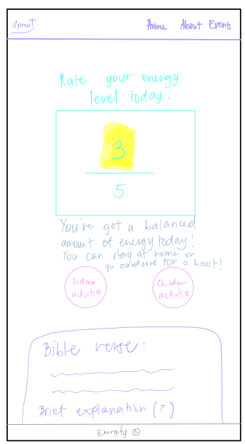

# Sprout

## Overview
Sprout is a personalised lifestyle app that combines activity suggestions with faith-based inspiration, tailored to the user's current energy level. The app provides users with comforting or energy boosting activities and uplifting Bible verses to enrich their day, helping them nurture both physical and faith aspects of their lives.

### Problem Space
During this bootcamp, I found it challenging to keep up with both my physical and spiritual well-being. I began to neglect my daily Bible devotions and outdoor activities, which are essential for maintaining balance and growth. As a Christian, this experience highlighted the importance of nurturing both aspects of my life, even in the midst of intense schedules. Sprout is my response to this struggle. I created this app to help individuals who, like me, face difficulty maintaining their physical and spiritual health during busy periods. The name Sprout not only symbolises growth in faith, akin to how plants need care to thrive, but also reflects the "touch grass" advice often mentioned in lectures, emphasising the need for both physical and faith nurturing. Sprout is designed to remind and support users in their journey of growth by combining daily faith encouragement with practical activity suggestions.

### User Profile
Sprout targets individuals who seek a balanced lifestyle with both practical activity suggestions and faith-based support. Users will include busy professionals, students, and anyone looking to enrich their daily routine. They will use the app to:
    • Get tailored suggestions for activities based on their energy level.
    • Receive Bible verses that align with their current mood for faith-based encouragement. Special considerations include ensuring the app accommodates different energy levels and offers both high and low-intensity activity suggestions.

### Features
    • Energy Level Input: Users select their energy level on a scale from 1 to 5.
    • Activity Suggestions: Provide personalised recommendations for comforting activities based on a local JSON file.
    • Bible Verse Integration: Display uplifting Bible verses corresponding to the user’s energy level from Bible API.
    • Modal Pop-Ups: Display event suggestions through modal pop-ups on the home page.

## Implementation

### Tech Stack
    • Front-End: React for building the user interface.
    • Back-End (Optional): Express.js for server-side logic and API handling, if needed for security or data processing.
    • Libraries: Axios for making HTTP requests, React Modal for displaying pop-ups.

### APIs
    • Bible API: For retrieving inspirational Bible verses. Bible API Documentation
    • Activity Suggestions JSON Data File: A JSON file will be used to provide activity suggestions based on the user's energy levels. 
        Each energy level will include both indoor and outdoor activities along with a Bible verse:
            ○ Energy Level 1 (Very Low Energy): Focus on rest and reflection with calming activities like meditation, listening to worship music, and taking a slow walk.
            ○ Energy Level 2 (Low Energy): Engage in light, refreshing activities like yoga, reading devotionals, or enjoying a short walk at a local park.
            ○ Energy Level 3 (Moderate Energy): Encourage productive engagement with moderate activities like home workouts, casual games, or exploring new cafés.
            ○ Energy Level 4 (High Energy): Energise users with more active suggestions such as intense workouts, hiking, or creative projects.
            ○ Energy Level 5 (Very High Energy): Push for maximum engagement with high-intensity activities like HIIT workouts, rock climbing, and team sports.

### Sitemap
    1. Home Page:
        ○ User selects their energy level.
        ○ Icons/buttons for indoor and outdoor activities that open modal pop-ups.
        ○ Modal pop-ups display activities based on the user's energy level.
        ○ Bible verse is displayed directly on the home page, aligned with the selected energy level.
    2. Reflections Page (Optional):
        ○ This page opens if the reflections section is added.
        ○ Users can write their reflections or thoughts on the displayed Bible verse.
    3. Full Bible Verse Chapter Page (Optional):
        ○ This page displays the full Bible verse and context.
        ○ Users can click on the Bible verse from the home page to view more details and the full passage.

### Mockups

### Data
    • User Data: Energy level.
    • Activity Data (JSON): Activity name, description, energy level (1-5).
    • Bible Verses Data: Verse text, reference.

### Endpoints
    • GET /bible/verse
        ○ Description: Retrieves a Bible verse based on the user’s energy level.
        ○ Parameters: energy_level (1-5).
        ○ Example Response: Bible verse text and reference.

## Roadmap
Day 1: Set up project structure and initialise React app.
Day 2: Design the home page and energy level selection interface.
Day 3: Create and populate the JSON file for activity suggestions based on energy levels. Implement user input handling and add modal components.
Day 4-5: Build and style activity suggestions using the JSON data. Integrate Bible API and design Bible verse display.
Day 6: Implement and style modal pop-ups for activity suggestions.
Polish UI and ensure responsiveness.
Day 7-8: Add reflection section for Bible verses (optional, but would be really good to have. Refine animations and interactions).
Day 9-10: User testing, final design tweaks, and debugging.

## Nice-to-Have Features:
Reflection Section: Add a section where users can reflect on Bible verses.
Eventbrite/Bored API Integration: Fetch local events and tailor them to the user's energy level.

## Future Implementations
    • User Authentication (Optional): Add functionality for user accounts and personalised settings.
    • Enhanced Recommendations: Implement more advanced algorithms for suggesting activities based on user history and preferences.
    • Feedback Mechanism: Allow users to provide feedback on activities and Bible verses to improve future suggestions.
    • Server-Side Logic (Optional): Add backend for handling more complex data interactions and security features.
